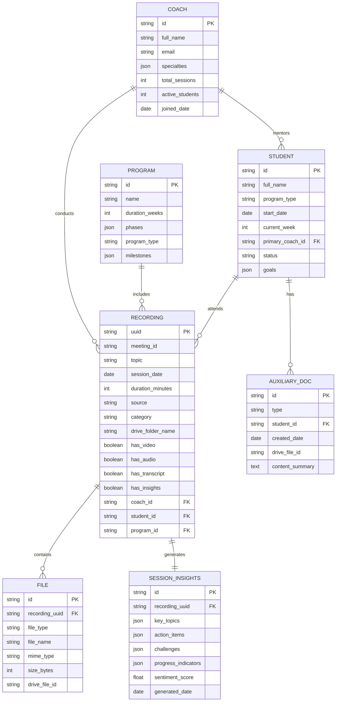
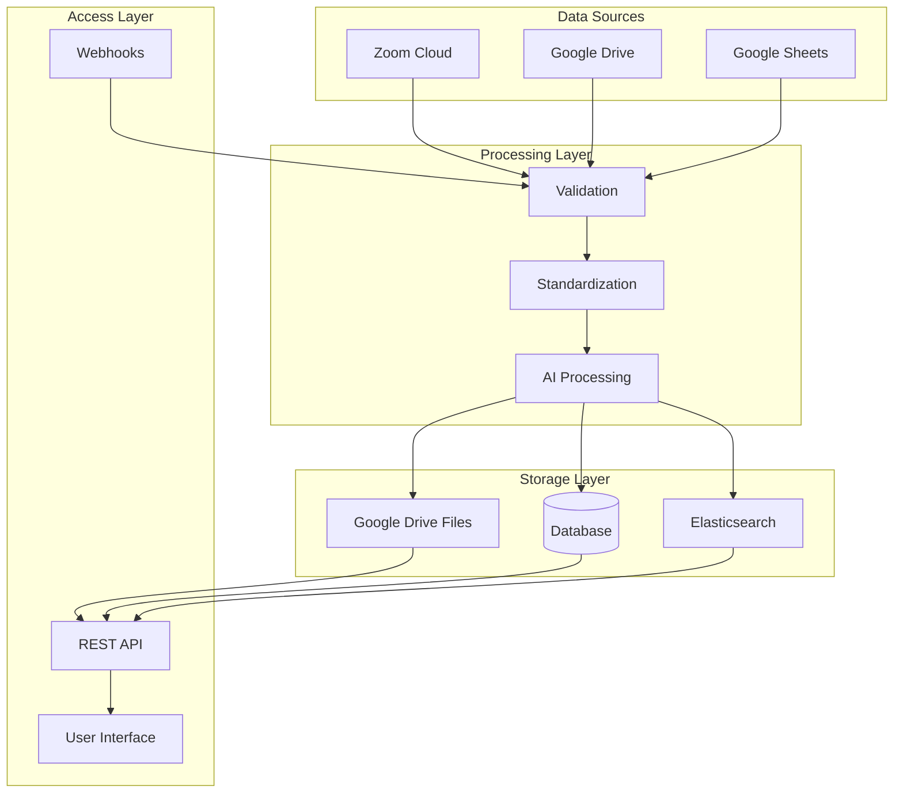

# Ivylevel Knowledge Base - Entity Relationship Diagram

## Visual Database Schema



## Relationships Explained

### Primary Relationships
1. **Coach ↔ Recording**: One coach can conduct many recordings
2. **Student ↔ Recording**: One student can attend many recordings
3. **Program ↔ Recording**: One program includes many recordings
4. **Recording ↔ Files**: One recording contains multiple files (video, audio, transcript, etc.)
5. **Recording ↔ Insights**: Each recording generates one insights document
6. **Student ↔ Auxiliary Docs**: Students have game plans and execution documents

### Data Flow


## Query Patterns

### 1. Student Journey Query
```sql
SELECT 
    r.uuid,
    r.session_date,
    r.topic,
    c.full_name as coach_name,
    si.key_topics,
    si.action_items
FROM recording r
JOIN coach c ON r.coach_id = c.id
JOIN session_insights si ON r.uuid = si.recording_uuid
WHERE r.student_id = 'arshiya'
ORDER BY r.session_date ASC;
```

### 2. Coach Performance Analytics
```sql
SELECT 
    c.full_name,
    COUNT(DISTINCT r.student_id) as total_students,
    COUNT(r.uuid) as total_sessions,
    AVG(si.sentiment_score) as avg_sentiment,
    JSON_AGG(DISTINCT s.specialties) as teaching_areas
FROM coach c
JOIN recording r ON c.id = r.coach_id
JOIN session_insights si ON r.uuid = si.recording_uuid
GROUP BY c.id, c.full_name;
```

### 3. Similar Session Search
```sql
WITH target_session AS (
    SELECT key_topics, student_id, program_id
    FROM recording r
    JOIN session_insights si ON r.uuid = si.recording_uuid
    WHERE r.uuid = 'dTXmwxPSTKm0rq9wdRG5pg=='
)
SELECT 
    r.uuid,
    r.topic,
    similarity(si.key_topics, ts.key_topics) as topic_similarity
FROM recording r
JOIN session_insights si ON r.uuid = si.recording_uuid
CROSS JOIN target_session ts
WHERE r.student_id != ts.student_id
    AND r.program_id = ts.program_id
ORDER BY topic_similarity DESC
LIMIT 10;
```

## Index Strategy

### Primary Indexes
- `recording.uuid` - Primary key, unique
- `recording.student_id + date` - Student timeline queries
- `recording.coach_id + date` - Coach session history
- `file.recording_uuid` - File retrieval

### Search Indexes (Elasticsearch)
- Full-text on `topic`, `transcript`, `insights`
- Vector embeddings for semantic search
- Faceted search on `coach`, `student`, `program`, `date`

### Performance Indexes
- `recording.source` - For source-specific queries
- `student.status` - Active student filtering
- `program.type` - Program categorization

## Data Integrity Rules

1. **UUID Uniqueness**: Every recording must have a unique UUID
2. **File Completeness**: Recordings should have at least video OR audio
3. **Relationship Integrity**: Coach and Student must exist before Recording
4. **Date Consistency**: Recording date must be within Program date range
5. **File Naming**: All files must follow standardized naming convention

## Access Control Matrix

| Role | Recordings | Students | Coaches | Analytics | Admin |
|------|------------|----------|---------|-----------|--------|
| Student | Own only | Self only | Read | Limited | No |
| Coach | Own + Assigned | Assigned | Self | Own | No |
| Admin | All | All | All | All | Yes |
| AI Agent | All (Read) | All (Read) | All (Read) | Generate | No |

---

*This ERD and schema documentation provides the foundation for building scalable AI-powered features on top of the Ivylevel Knowledge Base.*